# Assingment 1 - Virtual Machine creation

1. Create a new Azure account for yourself using your HAMK student ID (email) portal.azure.com & login.

2. Select Create a resource from Azure services,

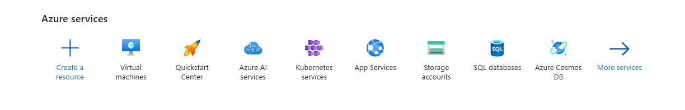

3. Select Virtual machine from services and click Create

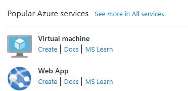

4. You can create resource group name and virtual machine name, Select the Region (Closest Region selected), and Select the "Ubuntu Server 24.04 LTS gen 2 Server published by Canonical"

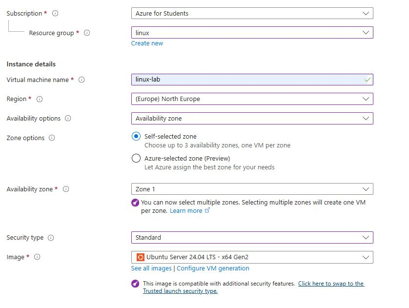

5. Set the machine virtual machine size to Standard_B2ls_v2 and use SSH public key for authentication type.

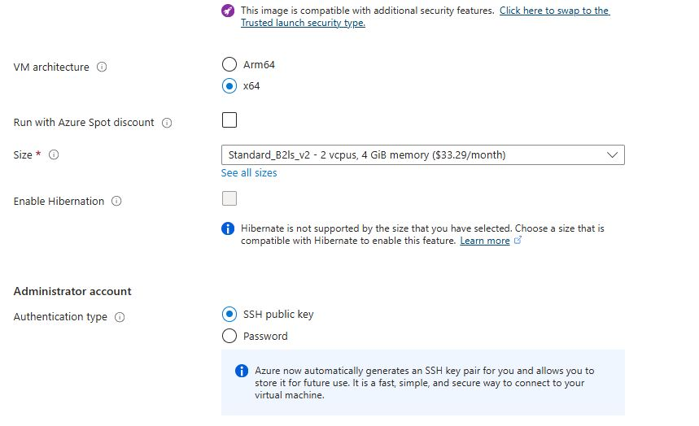

6. Add a user name and for authentication and select all inbound ports then press Next.

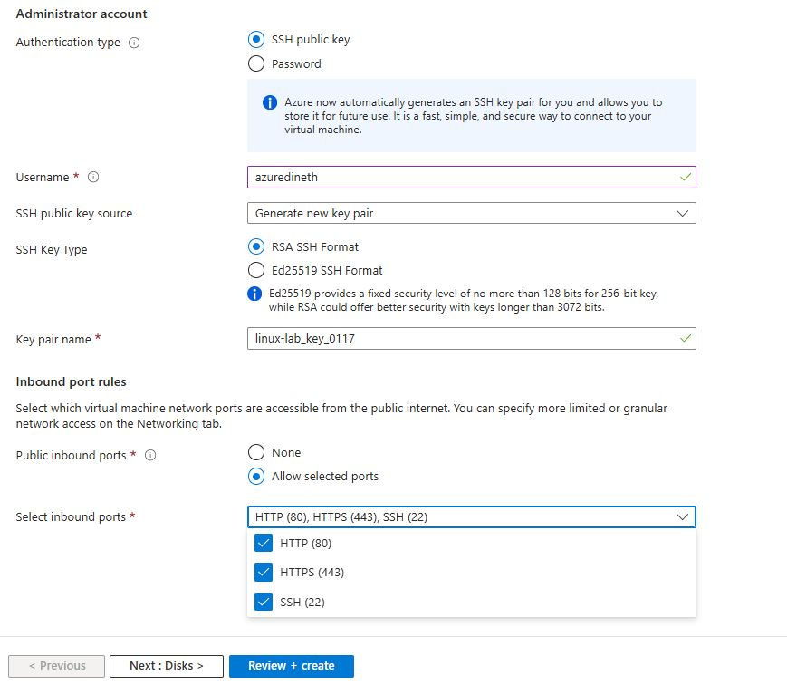

7. Select the "Standard SSD" disk type (Not premium) as it will reduce the billing and make sure that **"Delete with VM"** is clicked so it will delete the disk with VM.

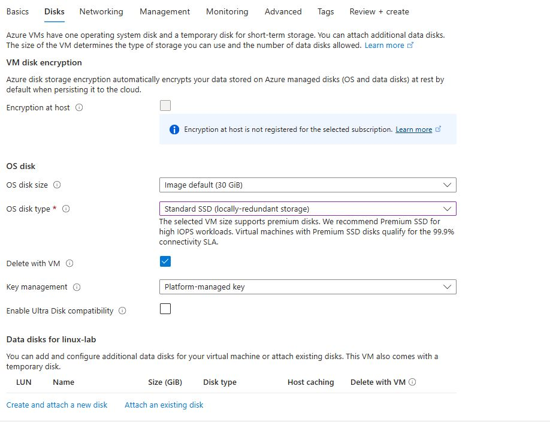

8. Continue with the following network settings,

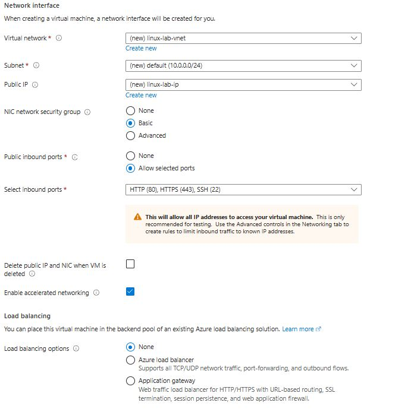

9. Update the auto shoutdown time so you do not have to pay for shutdowntime of the server. And click Review and Create.

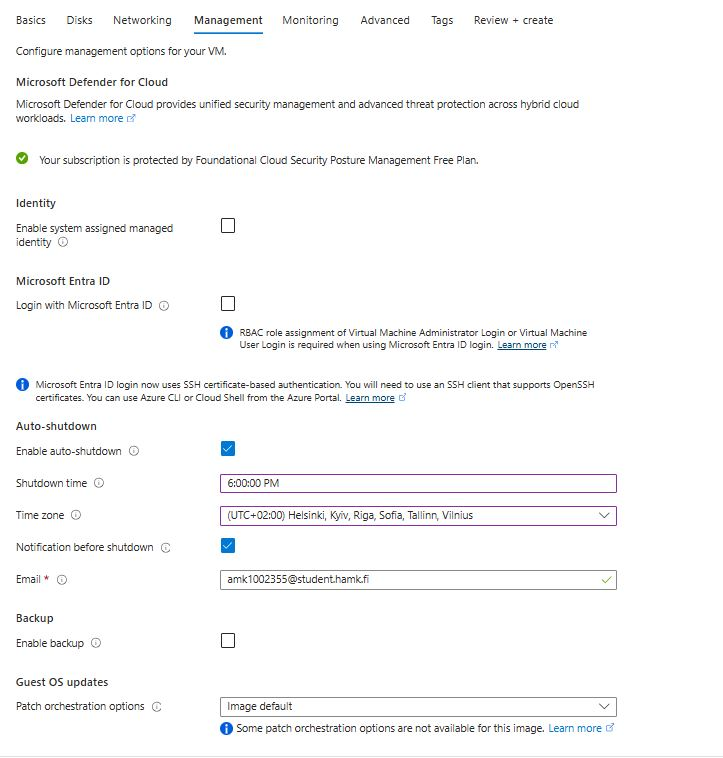

10. Once the validation passed it will show the summary of the if everything seems good create the vm.

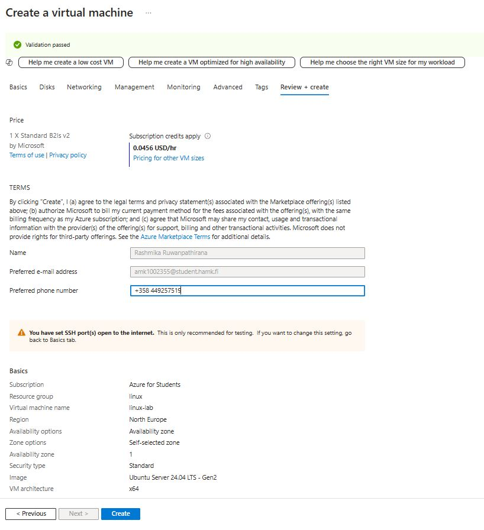

11. When creating the VM it will generate the SSH key and save it in a place that only you have access.

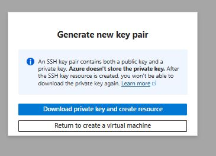

12. Save this key ".pem" file for future use. I save it under Keys folder in my documents.

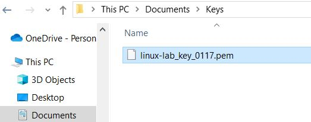

13. Once the creation is success you will see the success image as below,

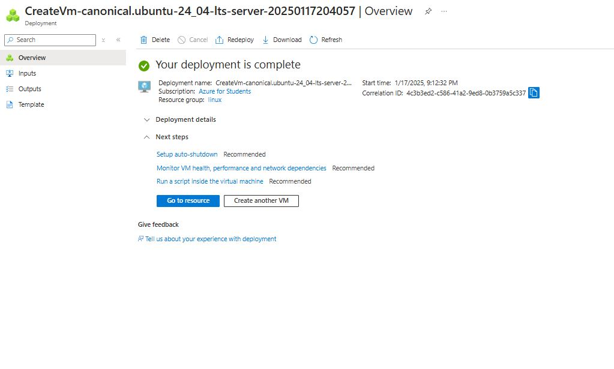

14. Once you go inside this VM you will see the Overview details as below,

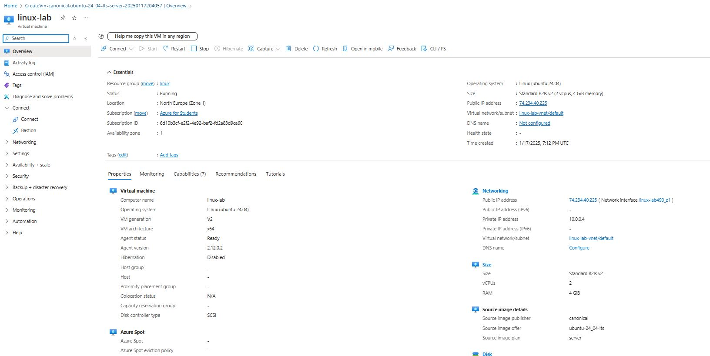

15. Now you need to set the DNS inorder to communicate with the VM,

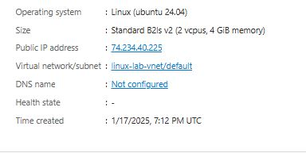

16. In Navigation select Connect => Connect to set up DNS name,

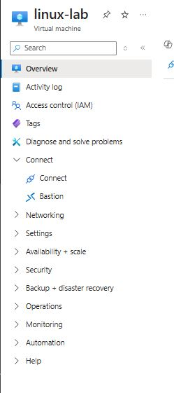
