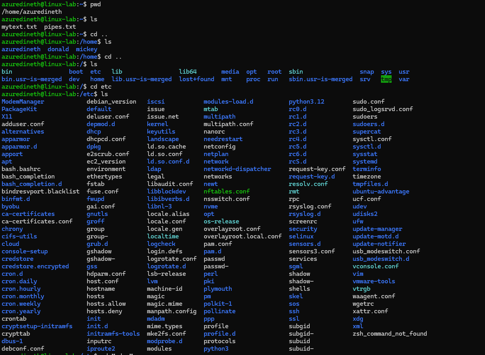
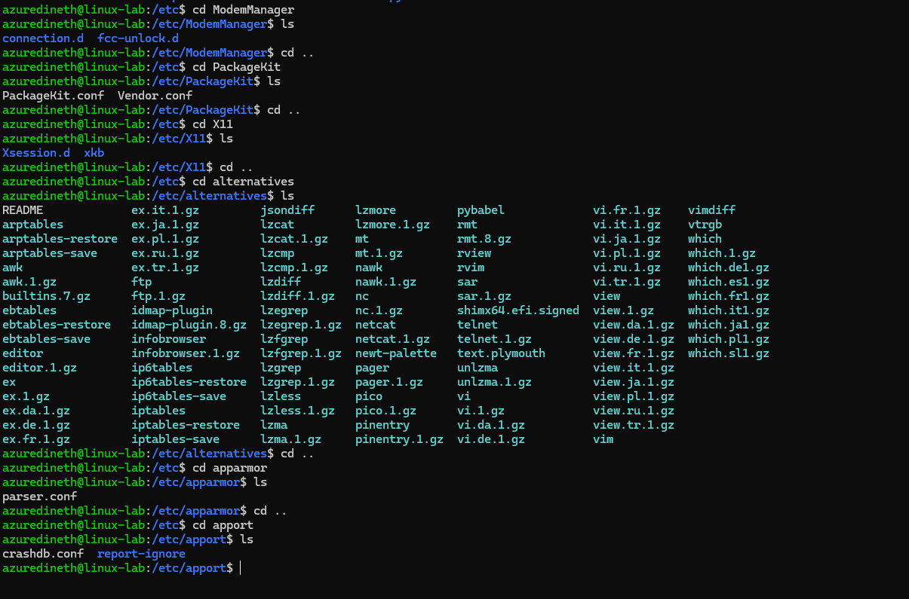
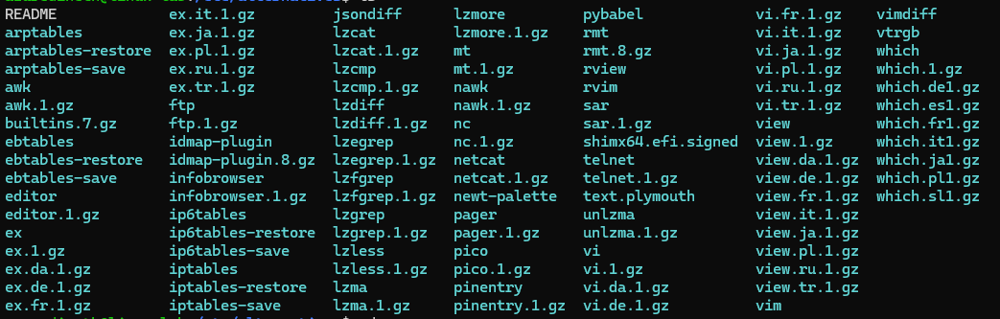

# Assingment 2 - List and append (2 points)

### Select five level 2 directories and save their contents in one file, "listing.md". Here "level 2" directory is for example /home/mylogin/, but not /tmp/ (level 1) or /usr/local/bin/ (level 3). Contents = listing of filenames.

- So to get level 2 directories I reverse back to main folder by cd.. and again cd .. then go in to first folder that shows (etc) and again cd to folders and get the content of those folders excluding hidden files using ls command,

So the listing is as below,

1. /etc/ModemManager/

   - connection.d
   - fcc-unlock.d

2. /etc/PackageKit/

   - PackageKit.conf
   - Vendor.conf

3. /etc/X11/

   - Xsession.d
   - xkb

4. /etc/alternatives/

   - 

5. /etc/apparmor/

   - parser.conf

6. /etc/apport/
   - crashdb.conf
   - report-ignore

## Appendix

`azuredineth@linux-lab:~$ pwd
/home/azuredineth
azuredineth@linux-lab:~$ ls
mytext.txt pipes.txt
azuredineth@linux-lab:~$ cd ..
azuredineth@linux-lab:/home$ ls
azuredineth donald mickey
azuredineth@linux-lab:/home$ cd ..
azuredineth@linux-lab:/$ ls
bin boot etc lib lib64 media opt root sbin snap sys usr
bin.usr-is-merged dev home lib.usr-is-merged lost+found mnt proc run sbin.usr-is-merged srv tmp var
azuredineth@linux-lab:/$ cd etc
azuredineth@linux-lab:/etc$ ls
ModemManager debian_version iscsi modules-load.d python3.12 sudo.conf
PackageKit default issue mtab rc0.d sudo_logsrvd.conf
X11 deluser.conf issue.net multipath rc1.d sudoers
adduser.conf depmod.d kernel multipath.conf rc2.d sudoers.d
alternatives dhcp keyutils nanorc rc3.d supercat
apparmor dhcpcd.conf landscape needrestart rc4.d sysctl.conf
apparmor.d dpkg ld.so.cache netconfig rc5.d sysctl.d
apport e2scrub.conf ld.so.conf netplan rc6.d sysstat
apt ec2_version ld.so.conf.d network rcS.d systemd
bash.bashrc environment ldap networkd-dispatcher request-key.conf terminfo
bash_completion ethertypes legal networks request-key.d timezone
bash_completion.d fstab libaudit.conf newt resolv.conf tmpfiles.d
bindresvport.blacklist fuse.conf libblockdev nftables.conf rmt ubuntu-advantage
binfmt.d fwupd libibverbs.d nsswitch.conf rpc ucf.conf
byobu gai.conf libnl-3 nvme rsyslog.conf udev
ca-certificates gnutls locale.alias opt rsyslog.d udisks2
ca-certificates.conf groff locale.conf os-release screenrc ufw
chrony group locale.gen overlayroot.conf security update-manager
cifs-utils group- localtime overlayroot.local.conf selinux update-motd.d
cloud grub.d logcheck pam.conf sensors.d update-notifier
console-setup gshadow login.defs pam.d sensors3.conf usb_modeswitch.conf
credstore gshadow- logrotate.conf passwd services usb_modeswitch.d
credstore.encrypted gss logrotate.d passwd- sgml vconsole.conf
cron.d hdparm.conf lsb-release perl shadow vim
cron.daily host.conf lvm pki shadow- vmware-tools
cron.hourly hostname machine-id plymouth shells vtrgb
cron.monthly hosts magic pm skel waagent.conf
cron.weekly hosts.allow magic.mime polkit-1 sos wgetrc
cron.yearly hosts.deny manpath.config pollinate ssh xattr.conf
crontab init mdadm ppp ssl xdg
cryptsetup-initramfs init.d mime.types profile subgid xml
crypttab initramfs-tools mke2fs.conf profile.d subgid- zsh_command_not_found
dbus-1 inputrc modprobe.d protocols subuid
debconf.conf iproute2 modules python3 subuid-
azuredineth@linux-lab:/etc$ cd ModemManager
azuredineth@linux-lab:/etc/ModemManager$ ls
connection.d fcc-unlock.d
azuredineth@linux-lab:/etc/ModemManager$ cd ..
azuredineth@linux-lab:/etc$ cd PackageKit
azuredineth@linux-lab:/etc/PackageKit$ ls
PackageKit.conf Vendor.conf
azuredineth@linux-lab:/etc/PackageKit$ cd ..
azuredineth@linux-lab:/etc$ cd X11
azuredineth@linux-lab:/etc/X11$ ls
Xsession.d xkb
azuredineth@linux-lab:/etc/X11$ cd ..
azuredineth@linux-lab:/etc$ cd alternatives
azuredineth@linux-lab:/etc/alternatives$ ls
README ex.it.1.gz jsondiff lzmore pybabel vi.fr.1.gz vimdiff
arptables ex.ja.1.gz lzcat lzmore.1.gz rmt vi.it.1.gz vtrgb
arptables-restore ex.pl.1.gz lzcat.1.gz mt rmt.8.gz vi.ja.1.gz which
arptables-save ex.ru.1.gz lzcmp mt.1.gz rview vi.pl.1.gz which.1.gz
awk ex.tr.1.gz lzcmp.1.gz nawk rvim vi.ru.1.gz which.de1.gz
awk.1.gz ftp lzdiff nawk.1.gz sar vi.tr.1.gz which.es1.gz
builtins.7.gz ftp.1.gz lzdiff.1.gz nc sar.1.gz view which.fr1.gz
ebtables idmap-plugin lzegrep nc.1.gz shimx64.efi.signed view.1.gz which.it1.gz
ebtables-restore idmap-plugin.8.gz lzegrep.1.gz netcat telnet view.da.1.gz which.ja1.gz
ebtables-save infobrowser lzfgrep netcat.1.gz telnet.1.gz view.de.1.gz which.pl1.gz
editor infobrowser.1.gz lzfgrep.1.gz newt-palette text.plymouth view.fr.1.gz which.sl1.gz
editor.1.gz ip6tables lzgrep pager unlzma view.it.1.gz
ex ip6tables-restore lzgrep.1.gz pager.1.gz unlzma.1.gz view.ja.1.gz
ex.1.gz ip6tables-save lzless pico vi view.pl.1.gz
ex.da.1.gz iptables lzless.1.gz pico.1.gz vi.1.gz view.ru.1.gz
ex.de.1.gz iptables-restore lzma pinentry vi.da.1.gz view.tr.1.gz
ex.fr.1.gz iptables-save lzma.1.gz pinentry.1.gz vi.de.1.gz vim
azuredineth@linux-lab:/etc/alternatives$ cd ..
azuredineth@linux-lab:/etc$ cd apparmor
azuredineth@linux-lab:/etc/apparmor$ ls
parser.conf
azuredineth@linux-lab:/etc/apparmor$ cd ..
azuredineth@linux-lab:/etc$ cd apport
azuredineth@linux-lab:/etc/apport$ ls
crashdb.conf report-ignore
azuredineth@linux-lab:/etc/apport$`
