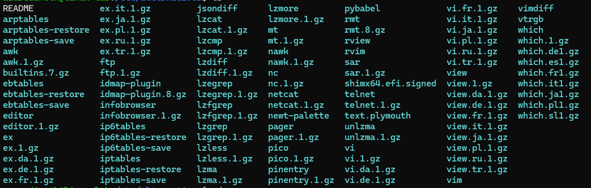

1. /etc/ModemManager/

   - connection.d
   - fcc-unlock.d

2. /etc/PackageKit/

   - PackageKit.conf
   - Vendor.conf

3. /etc/X11/

   - Xsession.d
   - xkb

4. /etc/alternatives/

   - 

5. /etc/apparmor/

   - parser.conf

6. /etc/apport/
   - crashdb.conf
   - report-ignore
