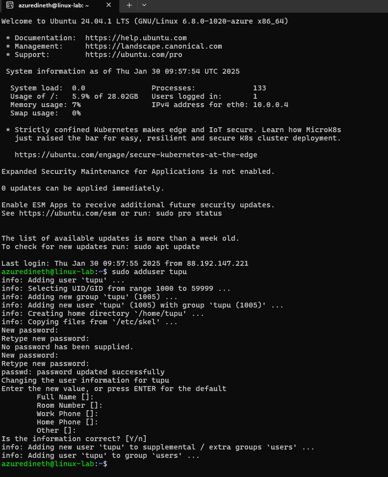
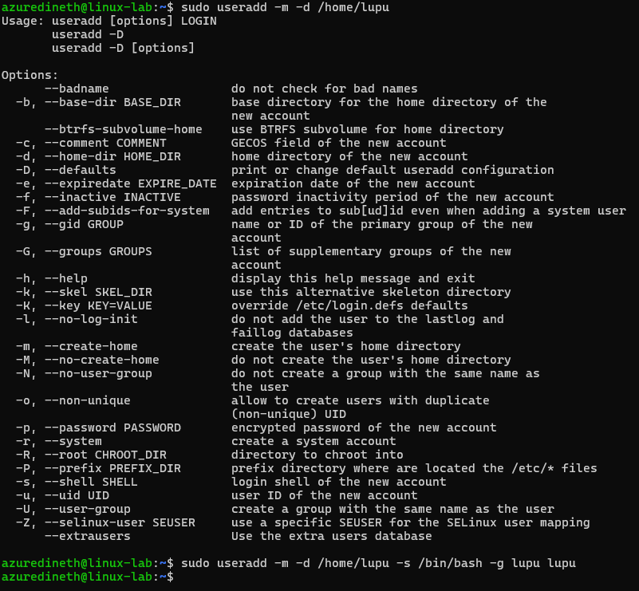
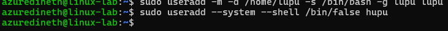
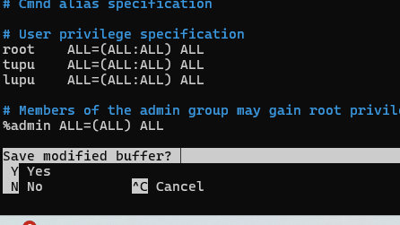
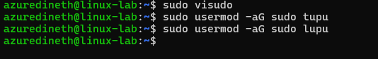
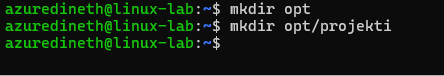
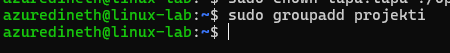
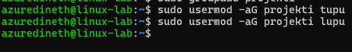
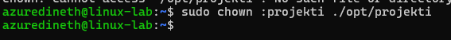
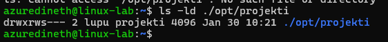

# Assignment 3

---

## TASK

**Task is to create users and use created users to test out file access permissions**

**Task will instruct you to create some users and make changes to file system. This task should be completed on your Virtual Machine. Make sure to make notes when you advance through the task to make documentation at the end of the task.**

---

Task submission:
Submit documentation using GitHub repository. Make Markdown file to explain how you accomplished task points 1-5. Make screen captures of relevant points in each and write an explanation for fifth task point. Submit only URL to markdown file. You can use basic markdown guide on Github as reference to creating markdown file. Repository can be same as in assignment 1.

---

1. Create the Tupu user using the adduser script:

sudo adduser tupu

---

2. Create the Lupu user using the useradd command. Try to create a user profile, home directory, and user group similar to Tupu.

- sudo useradd -m -d /home/lupu -s /bin/bash -g lupu lupu
- -m: Create the user's home directory.
- -d /home/lupu: Specify the home directory path.
- -s /bin/bash: Set the login shell to /bin/bash.
- -g lupu: Add the user to the lupu group.

---

3. Create the Hupu system user with the login shell set to /bin/false

- sudo useradd --system --shell /bin/false hupu
- --system: Create a system account.
- --shell /bin/false: Set the login shell to /bin/false to prevent login.

---

4. Add the users Tupu and Lupu to the sudo users.
   You can use the visudo command to edit the sudoers file directly, or add the users to the sudo group:

### Using visudo to edit sudoers file:

- sudo visudo

Add the following lines:

tupu ALL=(ALL:ALL) ALL
lupu ALL=(ALL:ALL) ALL

- Use Ctrl+x and press Y to save the updated file.

### Adding users to the sudo group:

- sudo usermod -aG sudo tupu
- sudo usermod -aG sudo lupu

---

5. Create a directory /opt/projekti and add both users (Tupu and Lupu) as owners. Only Tupu and Lupu should have access to list files in the directory, read, and modify them.
   This wont be instructed. Idea is to create a group of users, assign this group to owner of folder and files.
   To ensure that the permission structure is maintained for newly created files and folders, we should set up a common group and use the setgid bit on the directory.
   Idea is that any files or directories created within /opt/projekti will automatically inherit the projekti group ownership, maintaining the desired permission structure.

- Create a directory /opt/projekti

- Create a Group call projekti

- Add Users tupu and lupu to the Group

- Assign the Group Ownership to /opt/projekti

- Set Permissions to Allow Only tupu and lupu Access

- Check the permissions

---

- 2 → Enables the setgid bit (ensures new files inherit the projekti group).
- 7 → Full access (read, write, execute) for the owner (root).
- 7 → Full access (read, write, execute) for the group (projekti).
- 0 → No access for others (prevents unauthorized users from listing, reading, or modifying files).

---
