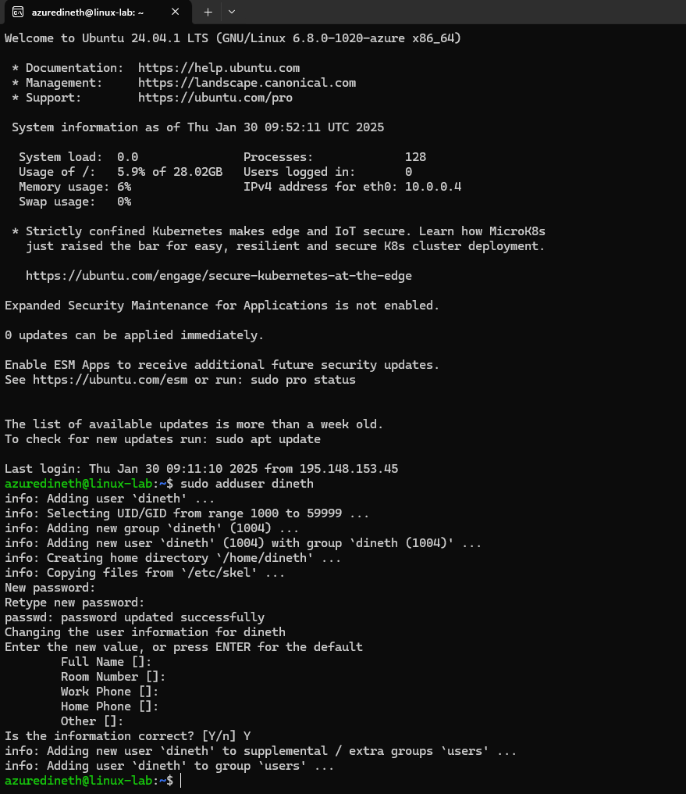

# Assignment 3

---

## TASK

**Task is to create users and use created users to test out file access permissions**

**Task will instruct you to create some users and make changes to file system. This task should be completed on your Virtual Machine. Make sure to make notes when you advance through the task to make documentation at the end of the task.**

---

1. Create the Tupu user using the adduser script:

sudo adduser dineth

2.
