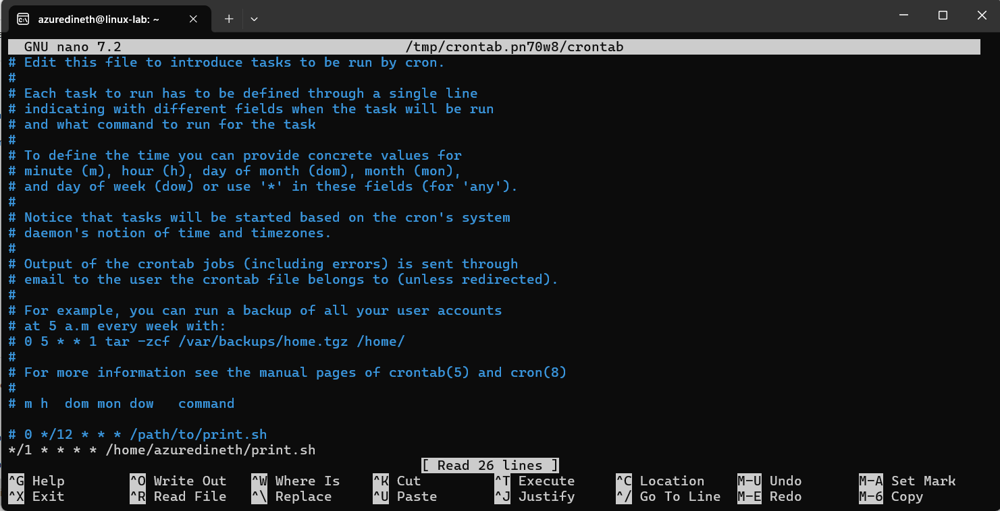
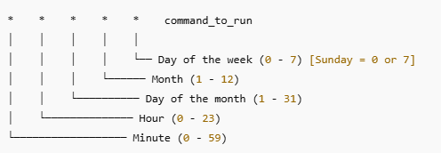
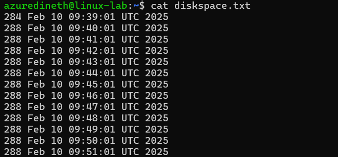
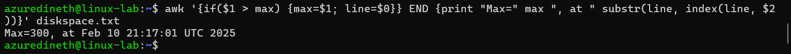
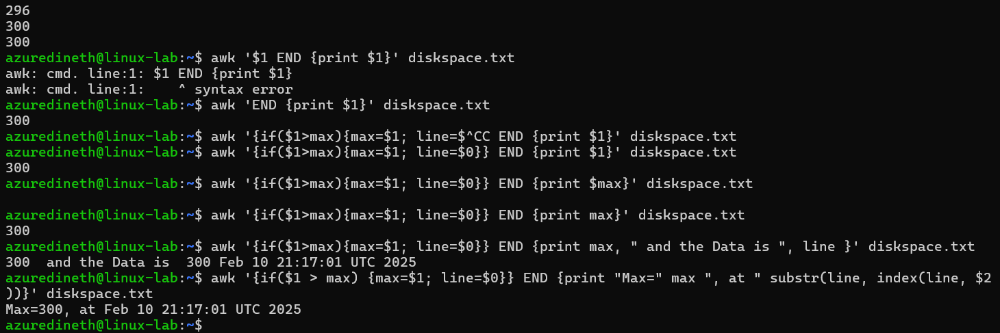

# Assignment 5

### Make a script and add it to cron

- using crontab automation, let the script "print.sh" run every 12 hours, that is, twice a day

- Write the script "print.sh", that adds one line to file "diskspace.txt" reporting home directory size and date, example:
- - 3596 Jan 31 13:26:11 EET 2025
- let the script run minimum 6 times (there are at least 6 lines in file "discspace.txt" now)

- now write a command using awk-tool (manual) to find a line containing maximum size from "discspace.txt" and print it. Example output:
- - Max=3596, at Jan 31 13:26:11 EET 2025

1. First we need to identify the current size of the directory size. for this we can use

```
du -s $HOME
```

- du (Disk Usage) – Estimates file space usage.
- -s (Summary) – Provides only the total size of the specified directory instead of listing each subdirectory.
- $HOME – Expands to the current user's home directory (e.g., /home/azuredineth).


2. Next we need to print the date in the format `Jan 31 13:26:11 EET 2025`,

```
date '+%b %d %H:%M:%S %Z %Y'
```

- %b → Abbreviated month name (e.g., Feb for February).
- %d → Day of the month (e.g., 10 for the 10th day).
- %H → Hour in 24-hour format (e.g., 14 for 2 PM).
- %M → Minutes (e.g., 45).
- %S → Seconds (e.g., 30).
- %Z → Time zone abbreviation (e.g., UTC, EST).
- %Y → Four-digit year (e.g., 2025).


3. Now we need to append this data and save it in the diskspace.txt file, So write below code to print.sh and save it.

```
#!/bin/bash

# Get the size of the home directory in KB
HOME_SIZE=$(du -s $HOME | awk '{print $1}')

# Get the current date and time
CURRENT_DATE=$(date '+%b %d %H:%M:%S %Z %Y')

# Append the information to diskspace.txt
echo "$HOME_SIZE $CURRENT_DATE" >> diskspace.txt

```


- Home will give the Home directry size, and CURRENT_DATE gives the date.
- Last line will combile these two and add to the last line of the txt file when execute.

4. Now we need to update cron jobs, open corntab file under edit mode and update the file,

```
crontab -e
```


5. Add the following lines to execute the code in every 12 hours

```
0 */12 * * * /home/azuredineth/print.sh
```

6. Since I need to generate mock data I update to run it in every 1 min interval,

```
*/1 * * * * /home/azuredineth/print.sh
```



7. A cron job consists of five time fields followed by the command to execute:



8. Test the results



9. A command using awk-tool (manual) to find a line containing maximum size from "discspace.txt" and print it. Example output:

- - Max=3596, at Jan 31 13:26:11 EET 2025

```
awk '{if($1 > max) {max=$1; line=$0}} END {print "Max=" max ", at " substr(line, index(line, $2))}' diskspace.txt
```



- This will check if the $1 is greater than the max value, ($1 is the value of the first field),
- If so it assign the $1 value to max, and save the current line in line variable.

- Read all lines

```
awk '$1 {print $0}' diskspace.txt
```

- Read 1st Field only

```
awk '$1 {print $1}' diskspace.txt
```

- To print at the end of the operation,

```
awk 'END {print $1}' diskspace.txt
```

- To print the max value at the end of the operation,

```
awk '{if($1>max){max=$1; line=$0}} END {print max}' diskspace.txt
```

- - To print the max value and the line data at the end of the operation,

```
awk '{if($1>max){max=$1; line=$0}} END {print max, " and the Data is ", line }' diskspace.txt
```

- Since we need to print only sub set of the line data we use substr and indexing

```
substr(line, index(line, $2))
```

- So the final awk command is

```
awk '{if($1 > max) {max=$1; line=$0}} END {print "Max=" max ", at " substr(line, index(line, $2))}' diskspace.txt
```



- output of command "echo your_name"


