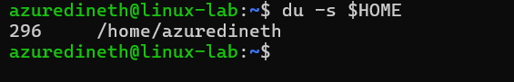
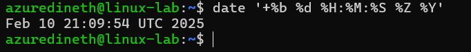
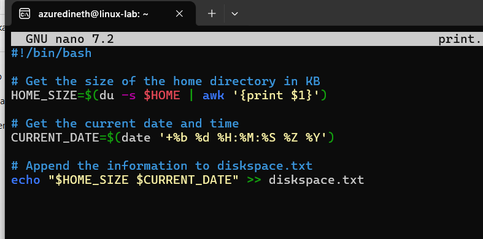

# Assignment 5

### Make a script and add it to cron

- using crontab automation, let the script "print.sh" run every 12 hours, that is, twice a day

- Write the script "print.sh", that adds one line to file "diskspace.txt" reporting home directory size and date, example:
- - 3596 Jan 31 13:26:11 EET 2025
- let the script run minimum 6 times (there are at least 6 lines in file "discspace.txt" now)

- now write a command using awk-tool (manual) to find a line containing maximum size from "discspace.txt" and print it. Example output:
- - Max=3596, at Jan 31 13:26:11 EET 2025

1. First we need to identify the current size of the directory size. for this we can use

```
du -s $HOME
```

- du (Disk Usage) – Estimates file space usage.
- -s (Summary) – Provides only the total size of the specified directory instead of listing each subdirectory.
- $HOME – Expands to the current user's home directory (e.g., /home/azuredineth).



2. Next we need to print the date in the format `Jan 31 13:26:11 EET 2025`,

```
date '+%b %d %H:%M:%S %Z %Y'
```

- %b → Abbreviated month name (e.g., Feb for February).
- %d → Day of the month (e.g., 10 for the 10th day).
- %H → Hour in 24-hour format (e.g., 14 for 2 PM).
- %M → Minutes (e.g., 45).
- %S → Seconds (e.g., 30).
- %Z → Time zone abbreviation (e.g., UTC, EST).
- %Y → Four-digit year (e.g., 2025).



3. Now we need to append this data and save it in the diskspace.txt file, So write below code to print.sh and save it.

```
#!/bin/bash

# Get the size of the home directory in KB
HOME_SIZE=$(du -s $HOME | awk '{print $1}')

# Get the current date and time
CURRENT_DATE=$(date '+%b %d %H:%M:%S %Z %Y')

# Append the information to diskspace.txt
echo "$HOME_SIZE $CURRENT_DATE" >> diskspace.txt

```



- Home will give the Home directry size, and CURRENT_DATE gives the date.
- Last line will combile these two and add to the last line of the txt file when execute.

4. Now we need to update cron jobs,
