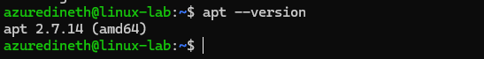
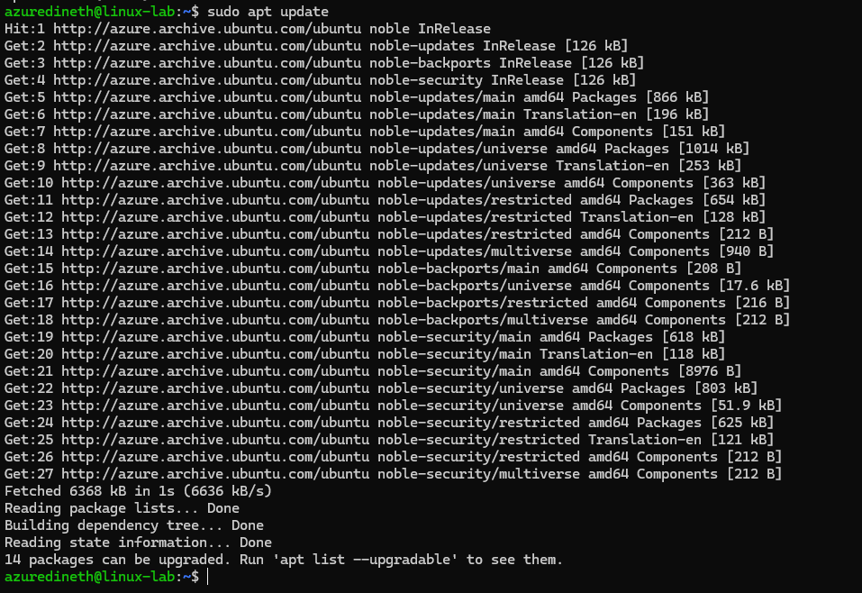
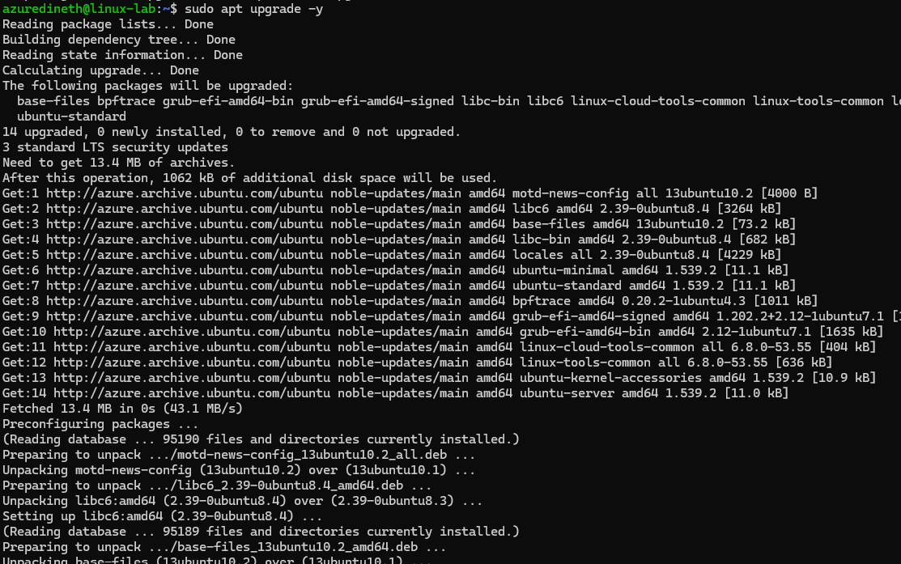
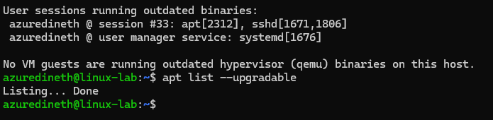
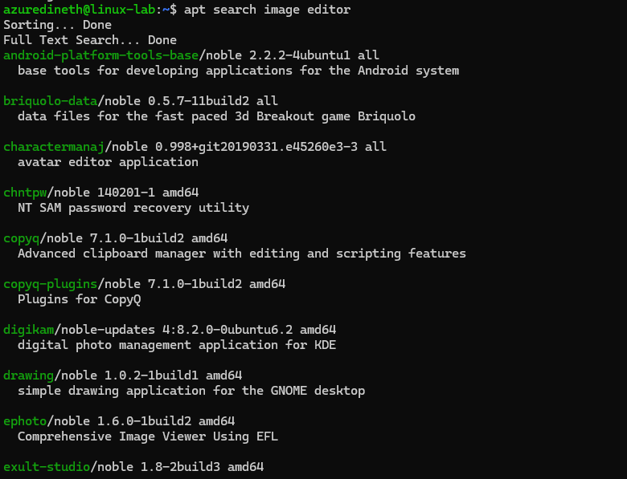

# Assingment 6 - APT

### Objective:

By completing this assignment, you will:

- ✅ Learn how to install, update, remove, and search for software using APT (Advanced Package Tool).
- ✅ Understand how to manage repositories and resolve package dependencies.
- ✅ Gain hands-on experience in troubleshooting package installation issues.

## Instructions

Perform the following tasks step by step, documenting your commands and outputs. If you encounter any errors, note them and describe how you resolved them.

---

#### Part 1: Understanding APT & System Updates (15 min)

1. Check your system’s APT version:

- Run the following command to display the installed APT version:
  apt --version

- Record the output.

2. Update the package list:

- Run the command:
  sudo apt update

- Explain why this step is important.

**This will check with the current installed versions and the latest stable versions that you can download**

- Get the latest package information
- Check whats need to be updated
- Get the security and bug fixes paches
- Update packages without dependancy issues

3. Upgrade installed packages:

- Run:
  sudo apt upgrade -y

- What is the difference between update and upgrade?

- upgrade: This will update the packages in the linux system.

- update: This will list down the updatable packages in the system without updating them.

4. View pending updates (if any):

- Run:
  apt list --upgradable
- Take note of any pending updates.

---

#### Part 2: Installing & Managing Packages (20 min)

5. Search for a package using APT:

- Find an image editor using:
  apt search image editor

- Pick one package from the list and write down its name.

xpaint/noble 2.9.1.4-4.1build2 amd64
simple paint program for X

6. View package details:

- Get detailed information about the selected package:
  apt show <package-name>
- What dependencies does it require?

7. Install the package:

- Run:
  sudo apt install <package-name> -y
- Confirm that the package is successfully installed.

8. Check installed package version:

- Run:
  apt list --installed | grep <package-name>
- What version was installed?

---

#### Part 3: Removing & Cleaning Packages (10 min)

9. Uninstall the package:

- Run:
  sudo apt remove <package-name> -y
- Is the package fully removed?

10. Remove configuration files as well:

- Run:
  sudo apt purge <package-name> -y
- What is the difference between remove and purge?

11. Clear unnecessary package dependencies:

- Run:
  sudo apt autoremove -y
- Why is this step important?

12. Clean up downloaded package files:

- Run:
  sudo apt clean
- What does this command do?

---

#### Part 4: Managing Repositories & Troubleshooting (15 min)

13. List all APT repositories:

- Run:
  cat /etc/apt/sources.list
- What do you notice in this file?

14. Add a new repository (example: universe repository):

- Run:
  sudo add-apt-repository universe
  sudo apt update
- What types of packages are found in the universe repository?

15. Simulate an installation failure and troubleshoot:

- Try installing a non-existent package:
  sudo apt install fakepackage
- What error message do you get?
- How would you troubleshoot this issue?

---

## Submission Requirements

- A markdown document containing:
- The commands you used.
- Screenshots (if possible) of important outputs.
- Answers to the questions provided in each step.
- Submit your work via GitHub repository URL.

---

## Bonus Challenge (Optional):

- Use apt-mark to hold and unhold a package so it doesn't get updated.
  sudo apt-mark hold <package-name>
  sudo apt-mark unhold <package-name>
- Why would you want to hold a package?
