# Assingment 6 - APT

### Objective:

By completing this assignment, you will:

- ✅ Learn how to install, update, remove, and search for software using APT (Advanced Package Tool).
- ✅ Understand how to manage repositories and resolve package dependencies.
- ✅ Gain hands-on experience in troubleshooting package installation issues.

## Instructions

Perform the following tasks step by step, documenting your commands and outputs. If you encounter any errors, note them and describe how you resolved them.

---

#### Part 1: Understanding APT & System Updates (15 min)

1. Check your system’s APT version:

- Run the following command to display the installed APT version:
  apt --version

- Record the output.

2. Update the package list:

- Run the command:
  sudo apt update

- Explain why this step is important.

**This will check with the current installed versions and the latest stable versions that you can download**

    - Get the latest package information
    - Check whats need to be updated
    - Get the security and bug fixes paches
    - Update packages without dependancy issues

3. Upgrade installed packages:

- Run:
  sudo apt upgrade -y

- What is the difference between update and upgrade?

  - upgrade: This will update the packages in the linux system.

  - update: This will list down the updatable packages in the system without updating them.

4. View pending updates (if any):

- Run:
  apt list --upgradable
- Take note of any pending updates.

---

#### Part 2: Installing & Managing Packages (20 min)

5. Search for a package using APT:

- Find an image editor using:
  apt search image editor

- Pick one package from the list and write down its name.

Package Name : xpaint - xpaint/noble 2.9.1.4-4.1build2 amd64 - simple paint program for X

6. View package details:

- Get detailed information about the selected package:
  apt show <package-name>
- What dependencies does it require?
  - Depends: libc6 (>= 2.35), libfontconfig1 (>= 2.12.6), libjpeg8 (>= 8c), libpng16-16t64 (>= 1.6.2), libtiff6 (>= 4.0.3), libx11-6, libxaw3dxft6t64 (>= 2.9.1.4), libxext6, libxft2 (>> 2.1.1), libxmu6 (>= 2:1.1.3), libxpm4, libxt6t64

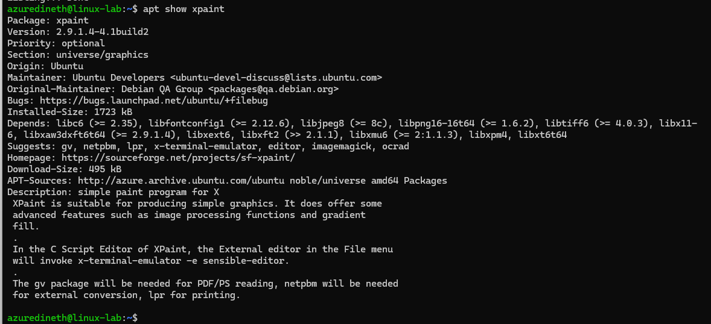

7. Install the package:

- Run:
  sudo apt install <package-name> -y

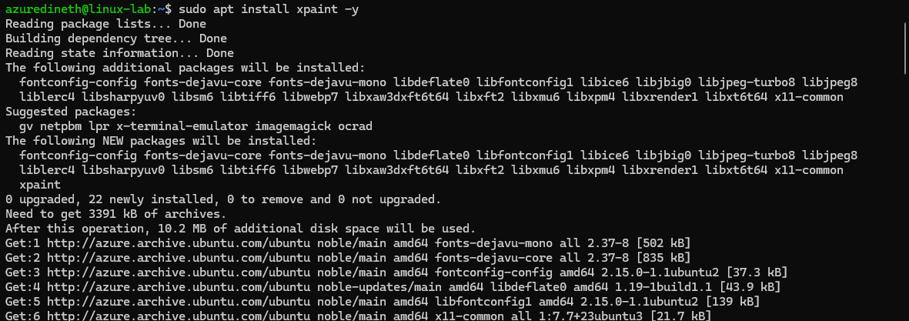

- Confirm that the package is successfully installed.

  - dpkg -l | grep xpaint

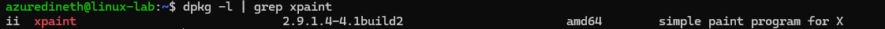

8. Check installed package version:

- Run:
  apt list --installed | grep <package-name>

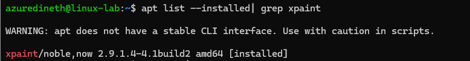

- What version was installed?

  - Version : 2.9.1.4-4.1build2

---

#### Part 3: Removing & Cleaning Packages (10 min)

9. Uninstall the package:

- Run:
  sudo apt remove <package-name> -y

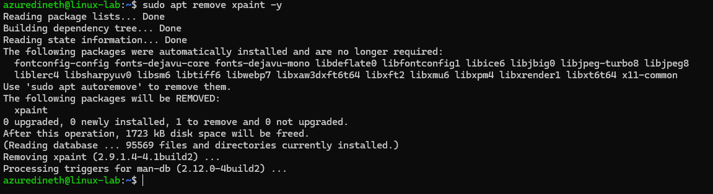

- Is the package fully removed?

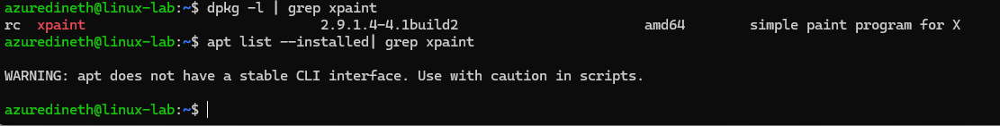

10. Remove configuration files as well:

- Run:
  sudo apt purge <package-name> -y

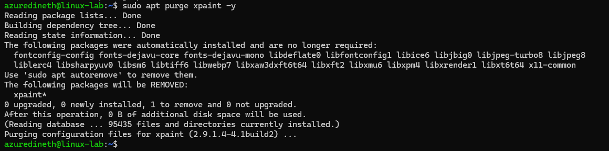

- What is the difference between remove and purge?
  - sudo apt remove <package-name> -y : This removes the package binaries and executables but keeps the configuration files.
  - sudo apt purge <package-name> -y : This removes the package along with its configuration files.

11. Clear unnecessary package dependencies:

- Run:
  sudo apt autoremove -y

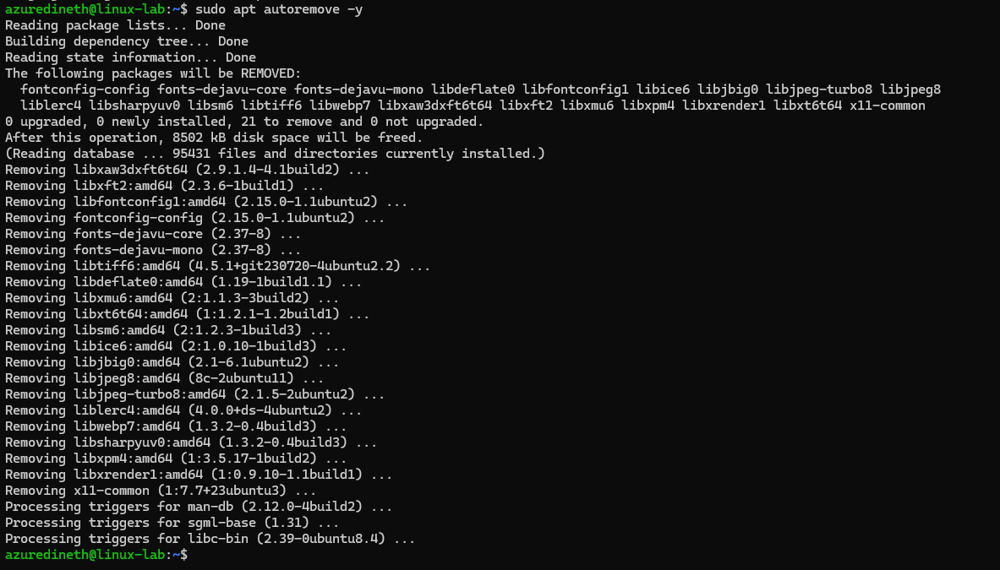

- Why is this step important?
  - It auto deletes the unessasary files in the system.

12. Clean up downloaded package files:

- Run:
  sudo apt clean

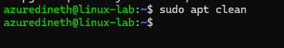

- What does this command do?
  - This command will clean only the cache data.

---

#### Part 4: Managing Repositories & Troubleshooting (15 min)

13. List all APT repositories:

- Run:
  cat /etc/apt/sources.list

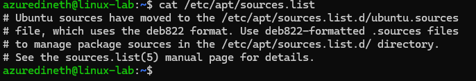

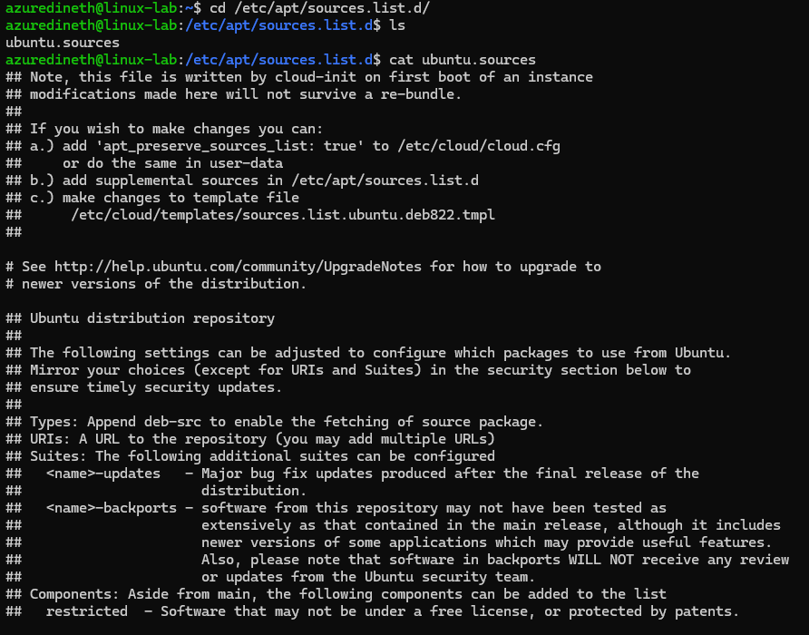

- What do you notice in this file?

  - This file contains the list of the dep file swhich is binary package repository (for installing software). So we can update this file so we can install the nessasary file packages along-side with ubuntu.

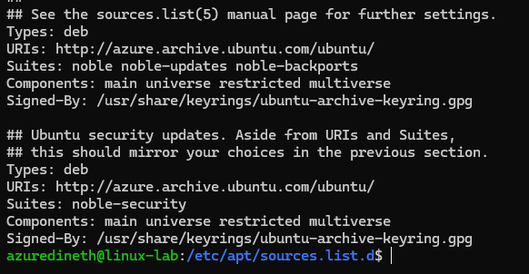

14. Add a new repository (example: universe repository):

- Run:
  sudo add-apt-repository universe
  sudo apt update

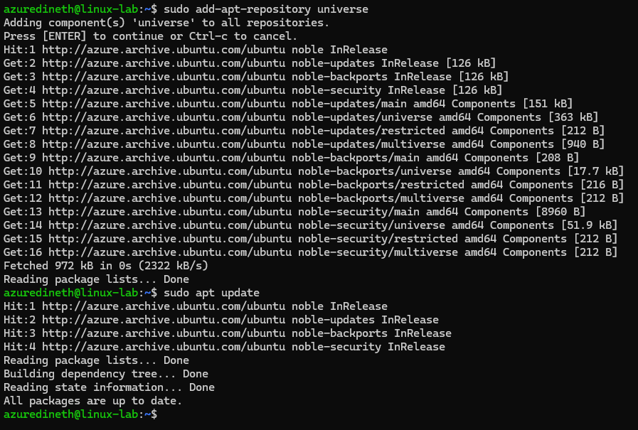

- What types of packages are found in the universe repository?
  - The packages which are not developed by Ubuntu is available in the universal apt-repository

15. Simulate an installation failure and troubleshoot:

- Try installing a non-existent package:
  sudo apt install fakepackage
- What error message do you get?
- How would you troubleshoot this issue?

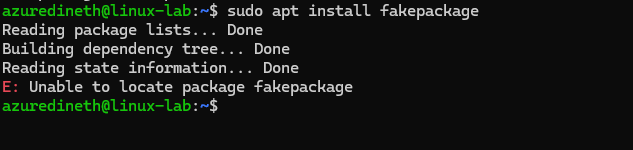

    - 1. To trobuleshoot this error first we need to identify there are no any word mistypings.
    - 2. Search the package using `apt search fakepackage` it will not display a list of similar packages if the package is incorrect.

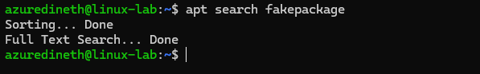

---

## Submission Requirements

- A markdown document containing:
- The commands you used.
- Screenshots (if possible) of important outputs.
- Answers to the questions provided in each step.
- Submit your work via GitHub repository URL.

---

## Bonus Challenge (Optional):

- Use apt-mark to hold and unhold a package so it doesn't get updated.
  sudo apt-mark hold <package-name>
  sudo apt-mark unhold <package-name>

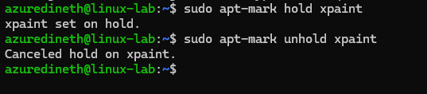

- Why would you want to hold a package?

  - You can hold a package if you want to keep the same version during the updates.
  - Sometimes updating a package might affect other installed packages on the system such as dependancy issues.
  - Some features might change / removed in the newer versions.
