# Assignment 7 - Virtualization

### Machine specs on Azure:

1. For use of virtualization in Linux its better to use a VM with higher performance.

2. So we create a VM with high performance,

### Checking virtualization support on machine:

1. Once the VM is created we can check the virtualization support by cpuinfo, **cat /proc/cpuinfo**

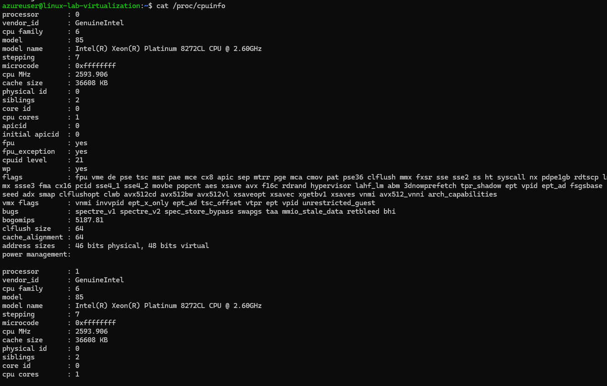

2. Am I using 64 bit CPU/system [x86_64/AMD64/Intel64]? IN flags check for **lm**

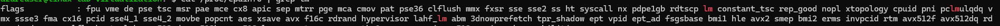

3. Do I have hardware virtualization support?

   - vmx – Intel VT-x, virtualization support enabled in BIOS.
   - svm – AMD SVM, virtualization enabled in BIOS.

   - Since we are using intel based system we only have VMX

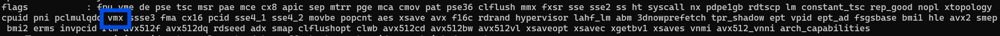

4.Do I have hardware AES/AES-NI advanced encryption support?

aes – Applications performing encryption and decryption using the Advanced Encryption Standard on Intel and AMD cpus.

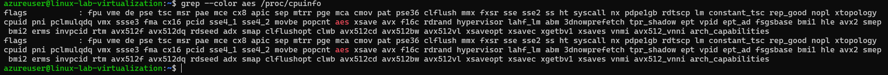

### # Install kvm-ok on a Debian/Ubuntu

1. sudo apt install cpu-checker

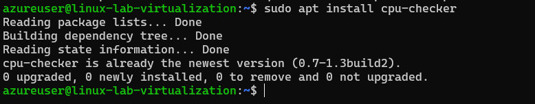

2. sudo kvm-ok

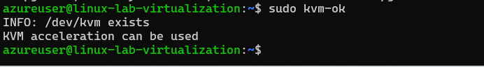

### Installing and managing LXD / LXC system

1. update your system by using apt: apt update && apt upgrade -y

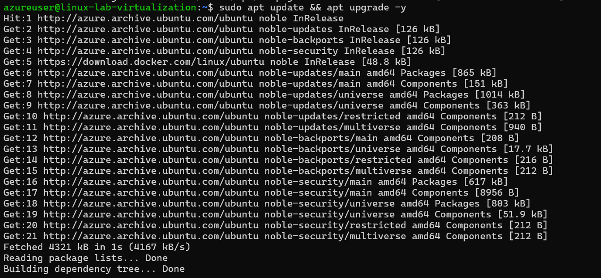
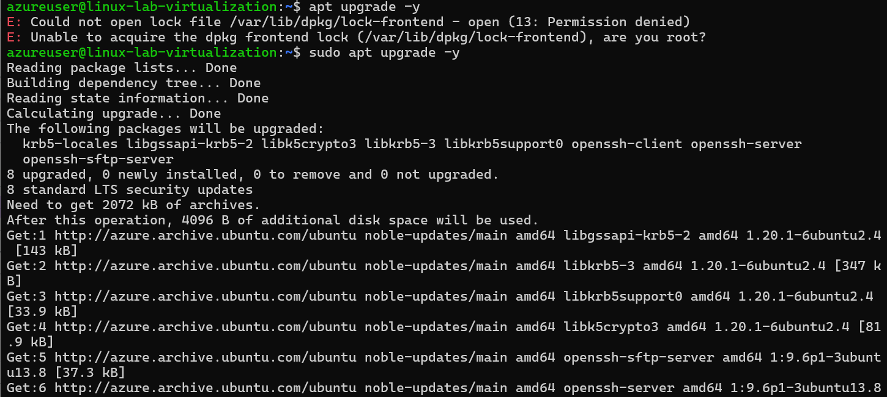
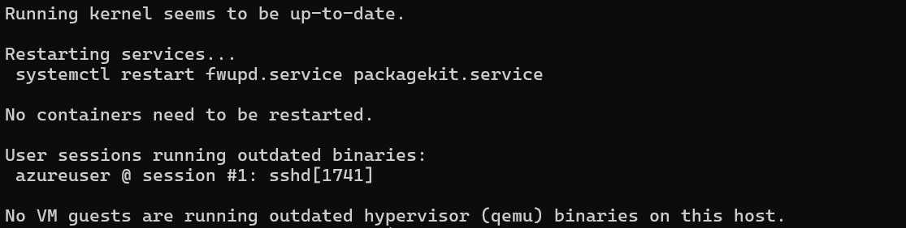

2. check if you just updated your kernel or other systems needing a complete system reboot, and if so, reboot: sudo reboot

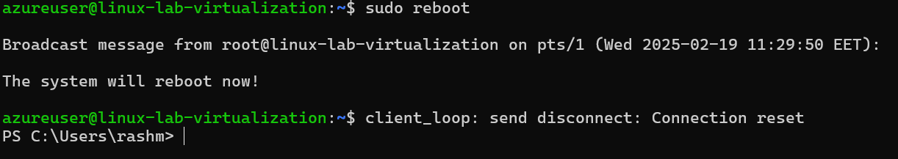

3. Install Snap: sudo apt install snap -y

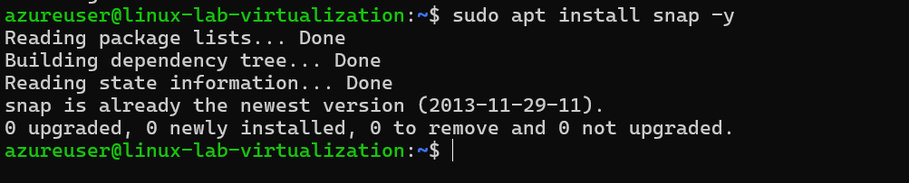

4. install lxd using snap: sudo snap install lxd

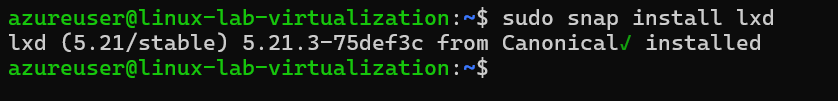

5. check lxd version and installation: lxd --version

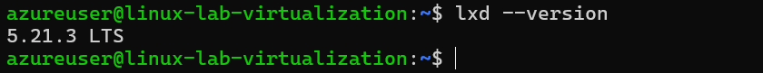

6. check that your user belongs to LXD group: id, and look for LXD. If you do not find lxd group, add user to it: sudo usermod -aG lxd $USER

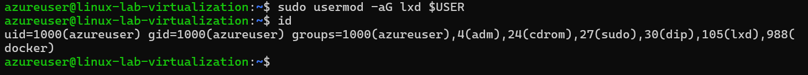

7. check lxc system for listing of machines and containers: lxc list

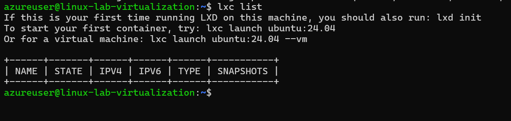

8. initialize xld, to configure system to your environment: lxd init. Make sure you run this as basic user, without root / sudo privileges it will ask series of questions, so based on your requirement answer them.

   - When it asks about clustering, choose ‘no’ (unless you’re setting up a cluster)
   - For storage, I recommend saying ‘yes’ to a new storage pool
   - The ‘dir’ backend is fine for beginners
   - Say ‘yes’ to a network bridge
   - Choose ‘no’ to make LXD sever available over the network.

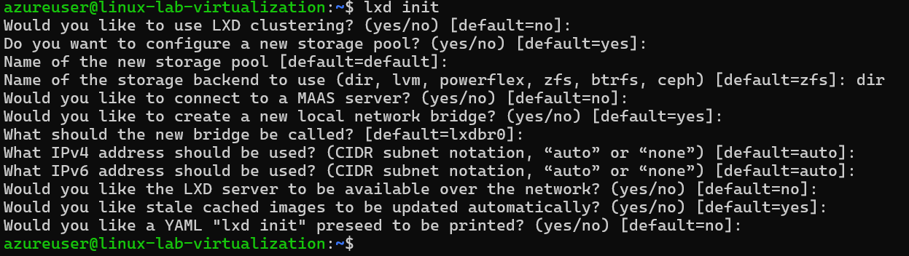

9. Once lxd is initialized successfully, we can verify the information using following set of commands:

$lxc profile list
$lxc network list
$lxc storage list

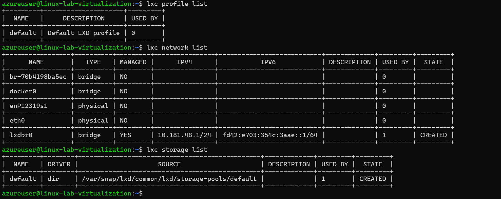

10. In order to list all available images, run:

$lxc image list images:

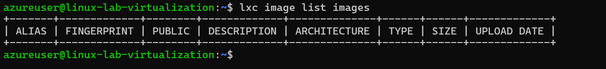

11. Create your first container:

$lxc launch ubuntu:24.04 demo-container

12. Access the console of container. Run:

$ lxc exec demo-container -- bash

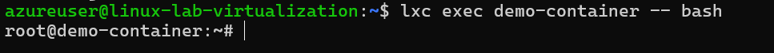
