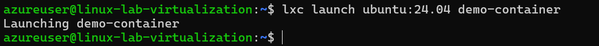

# Assignment 7 - Virtualization

### Machine specs on Azure:

1. For use of virtualization in Linux its better to use a VM with higher performance.

2. So we create a VM with high performance,

### Checking virtualization support on machine:

1. Once the VM is created we can check the virtualization support by cpuinfo, **cat /proc/cpuinfo**

2. Am I using 64 bit CPU/system [x86_64/AMD64/Intel64]? IN flags check for **lm**

3. Do I have hardware virtualization support?

   - vmx – Intel VT-x, virtualization support enabled in BIOS.
   - svm – AMD SVM, virtualization enabled in BIOS.

   - Since we are using intel based system we only have VMX

4.Do I have hardware AES/AES-NI advanced encryption support?

aes – Applications performing encryption and decryption using the Advanced Encryption Standard on Intel and AMD cpus.

### # Install kvm-ok on a Debian/Ubuntu

1. sudo apt install cpu-checker

2. sudo kvm-ok

### Installing and managing LXD / LXC system

1. update your system by using apt: apt update && apt upgrade -y

2. check if you just updated your kernel or other systems needing a complete system reboot, and if so, reboot: sudo reboot

3. Install Snap: sudo apt install snap -y

4. install lxd using snap: sudo snap install lxd

5. check lxd version and installation: lxd --version

6. check that your user belongs to LXD group: id, and look for LXD. If you do not find lxd group, add user to it: sudo usermod -aG lxd $USER

7. check lxc system for listing of machines and containers: lxc list

8. initialize xld, to configure system to your environment: lxd init. Make sure you run this as basic user, without root / sudo privileges it will ask series of questions, so based on your requirement answer them.

   - When it asks about clustering, choose ‘no’ (unless you’re setting up a cluster)
   - For storage, I recommend saying ‘yes’ to a new storage pool
   - The ‘dir’ backend is fine for beginners
   - Say ‘yes’ to a network bridge
   - Choose ‘no’ to make LXD sever available over the network.

9. Once lxd is initialized successfully, we can verify the information using following set of commands:

$lxc profile list
$lxc network list
$lxc storage list

10. In order to list all available images, run:

$lxc image list images:

11. Create your first container:

$lxc launch ubuntu:24.04 demo-container

12. Access the console of container. Run:

$ lxc exec demo-container -- bash

### Installing and managing Docker engine based system

#### Basic steps:

Follow good instructions from Docker, at https://docs.docker.com/

More specifically from Ubuntu engine install instructions for Ubuntu system, and using convenience script:

https://docs.docker.com/engine/install/ubuntu/#install-using-the-convenience-script

curl -fsSL https://get.docker.com -o get-docker.sh

sudo sh get-docker.sh

Executing docker install script, commit: 7cae5f8b0decc17d6571f9f52eb840fbc13b2737

<...>

post installation guide tells us to make user part of Docker group on Linux machine:

sudo groupadd docker

sudo usermod -aG docker $USER

newgrp docker

check docker version

#### Run Nginx on docker:

1. Get the latest Nginx

2. Start docker nginx image
   - docker run -p 80:80 nginx
   - docker run -d -p 80:80 nginx (To run on background use -d tag)

3. If we open the IP of our virtual machine we can see Nginx is running,

---

## Linux Virtualization Exercise

All exercises should be attempted on new Ubuntu 24.04 Linux installation, that supports nested virtualization.

### Part 1: Introduction to virtualization concepts (30 minutes)

Research: Using sources (Sources linked at the end of the task), learn about the following concepts:

##### Virtualization

​Virtualization is a technology that allows multiple operating systems or applications to run concurrently on a single physical machine by abstracting the underlying hardware resources. This is achieved through the use of hypervisors, which are software layers that create and manage virtual machines (VMs).​

##### Hypervisor

A hypervisor is software or firmware that creates and manages virtual machines (VMs) on a physical host. It allows multiple VMs to run on a single physical machine by abstracting and allocating hardware resources like CPU, memory, and storage.

##### Virtual machines (VM)

A virtual machine (VM) is a software-based emulation of a physical computer that runs an operating system (OS) and applications just like a real machine. VMs are created and managed by a hypervisor, which allocates CPU, memory, storage, and other resources from the physical hardware to the VM.

##### Containers

A container is a lightweight, portable software unit that packages an application and its dependencies together so it can run consistently across different environments. Unlike virtual machines (VMs), containers share the host operating system’s kernel, making them more efficient and faster.

##### The main differences between VMs and tanks

##### Summary: Summary in a text file briefly summarize the core differences between VMs and containers. Focus on their architecture, resource utilization, and insulation levels.

| Feature Virtual | Machines (VMs)                                                        | Containers                                                         |
| --------------- | --------------------------------------------------------------------- | ------------------------------------------------------------------ |
| Architecture    | Each VM has a full OS, including a guest OS and virtualized hardware. | Containers share the host OS kernel and run as isolated processes. |
| Resource Usage  | More resource-intensive due to separate OS instances.                 | Lightweight, as they share the OS kernel.                          |
| Startup Time    | Slower, since the OS needs to boot.                                   | Faster, since they don’t require OS booting.                       |
| Isolation       | Stronger isolation (separate OS for each VM).                         | Weaker isolation (process-level separation).                       |
| Portability     | Less portable, depends on the hypervisor.                             | Highly portable across different environments.                     |
| Scalability     | Requires more resources to scale.                                     | Easily scalable due to lightweight nature.                         |
| Use Case        | Best for running multiple OS environments or legacy applications.     | Best for microservices, cloud applications, and fast deployments.  |

---

### Part 2: Working with Multipass (1-2 hours)

Multipass is a command-line tool that allows you to quickly create and manage Ubuntu virtual machines.

##### Installation: Follow the instructions on the Multipass website to install Multipass on your system. More information can be found in the source.

1. Start VM and install Multipass.

`sudo snap install multipass`

2. Verify the installation

`multipass version`

##### Basic commands: Use the multipass command-line interface and practice the following:

1. ##### multipass boot: Launch the default Ubuntu instance.

`multipass launch --name my-instance`

`multipass launch --name multi-VM` (Name of the instance is multi-VM)

2. ##### multipass list: Lists all running instances.

`multipass list`

3. ##### multipass info: View details about a specific instance.

4. ##### multipass shell: Access to the shell of a running instance.

5. ##### multipass exec: Run the command on the instance.

6. ##### multipass stop: Stop the running instance.

7. ##### multipass delete: Delete the instance.

##### Cloud-init:Study: Learn about cloud-initi and how it can be used to configure virtual machines

##### Experiment: Create a cloud-init configuration file to customize the installation of a new instance.

- For example, you can install specific packages or assign users.
- Start a new instance of Multipass using this configuration.

##### File sharing: Find out: Explore how to share files and folders between your host computer and Multipass instances

1. Create a shared folder on your Linux VM

2. Mount the folder inside the Multipass instance

3. Check the shared folder inside the instance

##### Policy: Create a shared folder and access it from both your host and your Multipass instance.

1. Create sample.txt file inside VM and check availability inside custom-instance VM,

---

### Part 3: Exploring LXD (1 hour)

LXD is another container and virtual machine management built on LXC, the so-called "Virtual Machine Management" of the Linux container. Runtime.

Study: Read about LXD and its features on LinuxContainers website
Setup: Install LXD on your system, enable LXD
Basic commands: Experiment with basic LXD commands to create, manage, and interact with containers. You can find the starting point in the source

1. Install LXD
