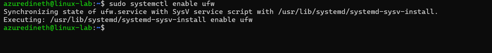
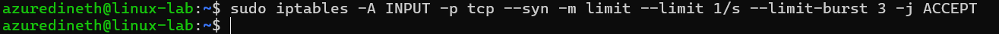

# Assignment 8

## Task:

### Create a firewall for your server that loads when the server starts.

1. Enable and Configure the Firewall to Start on Boot,

Update the packages and install ufw

Enable ufw on startup

### Define the following services for the firewall:

1. Openssh server : This allow SSH (port 22) traffic

Allow OpenSSH:

2. http and https server

3. Define the firewall so that all connections blocked by the firewall are logged.

4. Define a log for all known and allowed services.

5.  Create rules for the firewall that can prevent at least SYN flood type attacks. - This rate-limits SSH to prevent brute-force login attempts.
    

        - This limits new TCP connections to 1 per second with a burst of 3

    

6.  Find out what other common types of attacks you can prevent with your firewall. - ICMP (Ping) Flooding: Prevent ping floods by limiting ICMP requests:
    
    
    
    Check ping command
    

            - Port Scanning : Prevent port scans using:

        

7.  Define at least one rule identified in this study for the firewall.

- Defined above

Check the settings

