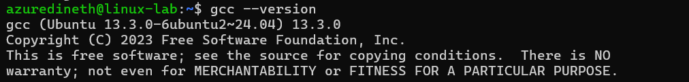
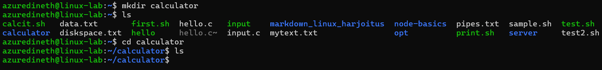
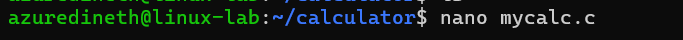
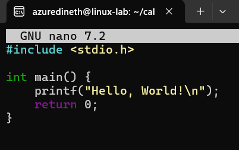
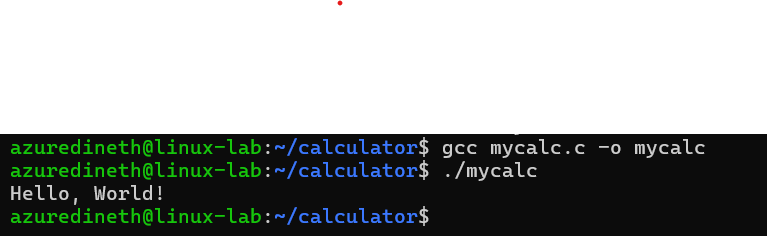
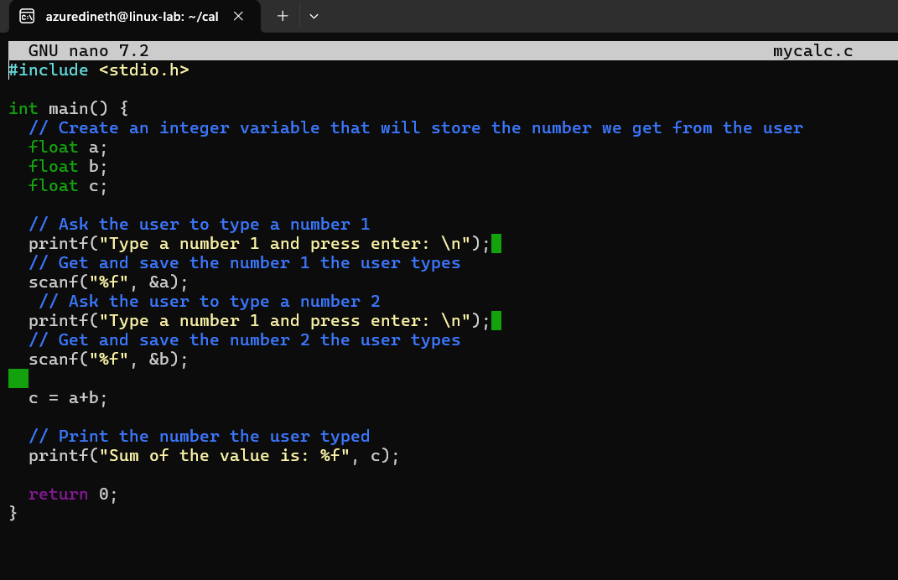
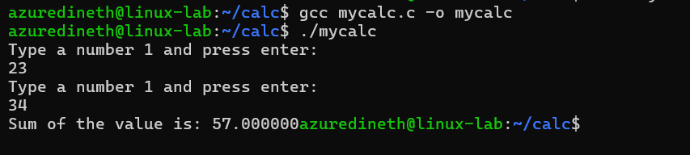

# Assignment 1 (6p)

---

## 1. Setting Up C Programming Environment on Linux

### A. Install the GCC Compiler

Most Linux distributions come with the GCC (GNU Compiler Collection) pre-installed. To check if GCC is installed, run:

    - gcc --version

If it's not installed, install it using:

Ubuntu/Debian:

    - sudo apt update

    - sudo apt install gcc

Once installed, verify by running:

    - gcc --version

Since we already have installed gcc compiler we do not need to install the compiler again.

### B. Make a small C program "mycalc.c" to ask user 2 numbers, and print the sum

1. For ease of use I created a directory called calculator and Im gonna use this folder to write my c program.

2. Create mycalc.c using nano editor.

3. Inorder to check our env & other setting, first try to run Hello world app,

   - Update the file
   - Save the file (Ctrl + s)
   - Exit from nano editor (Ctrl + x)

4. Compile the file and make mycalc program. (-o mycalc : Output will be mycalc)

   - gcc mycalc.c -o mycalc

5. Now Run the app and check if its working with no issues.

6. Now we can modify to add our calculator codes.

7. Compile and run the program

---

## 2. Part 2 - Setting up node JS server on Linux VM

1. Make the directory myserver and go inside the folder, get the latest update of apt updates,

2. Install the Node JS and check the version of node and npm, then initiate the node js program,

3. Install the node package express and update the index.js package (After this you can run index.js)

4. Following is the basic code of node js server

5. Update the firewall settings so that the port can be viewed from outside connections,

6. Run the server and check its working with the public ip address and your port id ( 'http://74.234.40.225:3000/' )

7. If you get the following msg then the server is running with no issues,

8. Update the index.js so the **/user** navigation can display user information by **process.env.USER**
   

9. Check the result with **/user** navigation,

